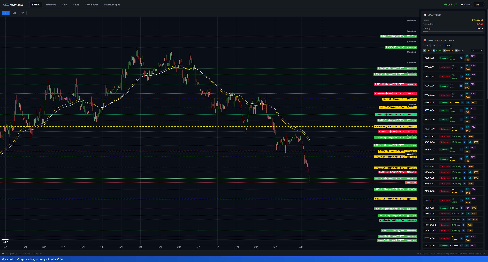

  
  

<h1 align="center">OKX Resonance</h1>

  <b>Multi-Dimensional Crypto Technical Analysis Desktop App</b> 
  加密货币多维度技术分析桌面应用

---

## ⚠️ Disclaimer

This software is designed solely for price action research and educational purposes. It does not provide any form of investment advice, trading recommendations, or financial guidance.

All market data displayed is sourced exclusively from OKX's public REST API. The app does not access, store, or transmit any user funds, private keys, or sensitive account information. Analysis outputs are derived from publicly available data and technical indicators — they carry no guarantee of accuracy or predictive value.

Use this tool at your own discretion. The author assumes no liability for any decisions made based on the information presented.

---

## What Is This?

**OKX Resonance** is a crypto technical analysis desktop tool that pulls market data from OKX exchange in real time and helps you read the market through multiple dimensions — all in one dashboard.

- **Trend Direction** — EMA144/169 dual MA system. Golden Cross / Death Cross / Entangled.
- **Support & Resistance** — 6-dimension scoring identifies historically critical price levels (Super / Strong / Weak).
- **Volume Profile** — POC, Value Area (70%), HVN.
- **Liquidation Heatmap** — Simulates potential liquidation clusters across 7 leverage tiers.
- **Order Wall** — Real-time bid/ask depth and pressure.
- **Confidence Score** — 8-factor 0–100% rating with 3 strategy modes.

No OKX API Key needed for basic analysis. Just open and go. 中文 / English / 日本語.

---

## Proprietary Algorithm Breakthrough

### 6-Dimension Resonance Scoring — Why Our S/R Is More Reliable

Most tools draw a flat horizontal line and call it "support". That gives you a number but no sense of how much confidence you should have in it. **OKX Resonance takes a different approach** — every S/R level must pass 6 independent checks before the algorithm assigns a rating:

- **Touch Count** (up to +5) — Price tested this level repeatedly in history without breaking through. Each valid touch adds +1.
- **Reversal Strength** (+2) — Price reversed more than 2x ATR after touching, indicating large capital defending this zone.
- **Psychological Level** (+1) — Round numbers, ten-thousand marks. Market participants naturally gravitate here.
- **FVG Gap** (+1) — Fair Value Gap — an unfilled liquidity void. Price has a strong magnetic pull back to this zone.
- **Liquidation Zone** (+1) — Dense leveraged positions accumulated here. A breach would trigger cascading liquidations.
- **Order Wall** (+1) — Current order book shows large resting orders forming immediate support/resistance.

**Only levels scoring ≥5 are marked as Super** — worth your full attention.

On top of this, the algorithm calculates independently for **1H, 4H, and 1D timeframes**, then merges results with weighted aggregation (0.5% threshold). When all three timeframes flag the same price level simultaneously — that is **Resonance**, and that is where the project gets its name.

> The point is not "someone drew a line on a chart." The point is "three timeframes and six dimensions are all screaming that this level matters."

---

### OI-Flow Liquidation Heatmap — Predicting Where Others Get Liquidated

Liquidation data is not publicly available from OKX. We built a **reverse-engineered model based on Open Interest flow (OI-Flow)** :

- Uses OKX's publicly available Open Interest historical changes to back-derive the entry prices of newly opened positions.
- Distributes weight across a **7-tier leverage model** (100x / 50x / 20x / 10x / 5x / 3x / 1x).
- Integrates the **Brunnermeier-Pedersen cascade amplification model**: simulates where one liquidation event pushes price into the next tier's liquidation zone, triggering a domino effect.

This is not the same as raw exchange liquidation data, but it is logically derived from the same risk assessment models used by market makers. **You are not just seeing "where people get liquidated" — you are seeing "where the next domino falls after this one."**

---

### 8-Factor Confidence Score — The Full Picture, Not Just Price

Eight independent factors, weighted into a 0–100% composite confidence rating:

- **EMA Trend Clarity** (weight 15) — Does the market even have a direction right now, or is it chopping sideways?
- **Distance to Strong S/R** (weight 20) — How far is current price from the nearest strong support or resistance? Is there enough buffer?
- **S/R Resonance Flag** (weight 15) — Are three timeframes simultaneously confirming the same level?
- **Large Order Direction** (weight 10) — Are recent big orders net buying or net selling?
- **Funding Rate** (weight 10) — Are longs overheating? Are shorts paying a premium?
- **Open Interest Direction** (weight 10) — Is money flowing into the market or retreating?
- **Multi-Timeframe Convergence** (weight 10) — Do 1H, 4H, and 1D all point the same way?
- **Volume Confirmation** (weight 10) — Does this candle's volume support the price direction?

The weights are not arbitrary. Price structure (S/R + Trend) accounts for 50% — that is the foundation. Sentiment and capital flow each account for 20% as auxiliary signals. The benefit: **even if one factor fails, the overall score does not get thrown off.**

---

## User Guide

### 1. Download

Get the latest `OKXResonance.exe` (~147MB) from the [Releases](https://github.com/zyairemiller/BTC-Resonance-SR-system/releases) page.

### 2. Launch

Double-click `OKXResonance.exe` — no Python, no runtime, no installation required.

On first run, Windows SmartScreen may show a warning. Click **More info** → **Run anyway**.

**Antivirus Notice**: `OKXResonance.exe` is packaged with PyInstaller, which may trigger false positives in some antivirus software (Windows Defender, 360, etc.). This is a known behavior of PyInstaller-packaged executables — the app only communicates with OKX's public API and runs a local web server on 127.0.0.1. It does not modify system files or transmit data externally. If your antivirus flags it, add the file to your exclusions list and run it normally.

After launch, your browser opens automatically to the dashboard (`http://127.0.0.1:18080`), along with a desktop window.

> To use the browser only (no desktop popup), launch via command line: `OKXResonance.exe --no-gui`.

### 3. First-Time Disclaimer

A disclaimer popup appears on first launch. Accept it to enter the main interface.

### 4. Interface Overview

- **Top Bar** — Instrument tabs (BTC / ETH / XAU / XAG / Spot). Click to switch. Live price, Guide button, language toggle.
- **Candlestick Chart** (main left area) — Candles with EMA144/169 overlays. Switch timeframe above: 1H / 4H / 1D.
- **Analysis Panel** (right side, 360px) — EMA trend card, S/R resonance card, Volume Profile, Order Wall, Liquidation Heatmap.
- **Bottom Bar** — Connection status, uptime.

### 5. Switching Instruments & Timeframes

- Click the top tabs to switch instruments. Wait a few seconds for data to load.
- Click **1H / 4H / 1D** above the chart to switch candlestick timeframe.
- S/R Resonance supports independent timeframe selection: 1H / 4H / 1D / ALL (cross-timeframe merge).

### 6. How to Read the Analysis

**EMA Trend**

- **GOLDEN_CROSS** — EMA144 above EMA169. Leaning bullish.
- **DEATH_CROSS** — EMA144 below EMA169. Leaning bearish.
- **ENTANGLED** — The two lines are intertwined. No clear direction. Better to wait.

**S/R Resonance**

- **Super** — Score ≥5. High-confidence critical level, repeatedly validated historically.
- **Strong** — Score ≥3. Decent reference value, confirmed by multiple dimensions.
- **Weak** — Score <3. Limited significance, likely just ordinary swing highs/lows.

**Confidence Score**

- **High ≥75** — Multiple dimensions align. Market signals are relatively clear.
- **Medium 50–74** — Partial alignment. Can serve as a reference.
- **Low 25–49** — Signals are fuzzy. Proceed with caution.
- **Very Low <25** — Direction is highly uncertain. Best to stay out.

### 7. Strategy Modes

Switch between three modes in the right panel:

- **Aggressive** — Min S/R score 8 + confidence 50%. Suited for scalping / high-frequency.
- **Balanced (default)** — Min S/R score 12 + confidence 65%. Suited for intraday / swing trading.
- **Conservative** — Min S/R score 15 + confidence 80%. Suited for medium-to-long-term positions.

### 8. Proxy Settings

If you use v2rayN, Clash, or similar proxies, the app auto-detects SOCKS5 ports (10808 / 7890 / 1080) and routes traffic through them. No manual config needed.

### 9. Activation (Optional)

Basic analysis works without activation. Activating unlocks higher-frequency data refresh.

- **OKX API Key** (recommended, free) — Create a read-only API Key, paste it into the activation page. Permanent after verification + 30-day grace period.
- **USDT TRC20 Payment** (29.9 USDT) — Pay and submit the TX Hash. Activates for 30 days.

> **Clearing API Authorization**: To remove a wrong API Key or wipe activation data, delete `C:\Users\YourName\.okx_trading\activation.json`. The app returns to an unactivated state.

---

## ⚠️ Disclaimer

This software is for educational and research purposes only.

- Cryptocurrency trading carries extreme risk and may result in total loss of capital.
- All analysis outputs **do not constitute investment advice**.
- The author assumes no liability for any trading losses resulting from use of this software.

> Terms such as "signal," "confidence," "support," and "resistance" refer to calculations derived from technical indicators and do not represent any trading recommendation.

---

## Support This Project

If you find this tool useful, please consider registering through our referral link. After activation, your dashboard unlocks the full feature set:

**OKX Referral Code**: `4870869` — [Register on OKX](https://www.okx.com/join/4870869)

Your support helps us continue upgrading and maintaining this project. Thank you!

---

## 📮 Contact

- **Telegram**: [t.me/okxresonce](https://t.me/okxresonce)
